# Awesome Environmental Health & Safety (EHS) Platform Ecosystem 🌿⚡ Shield

[](https://github.com/ishandutta2007/Awesome-Awesome-Awesome)<a href="https://discord.gg/jc4xtF58Ve"></a> [](https://creativecommons.org/publicdomain/zero/1.0/) [](http://makeapullrequest.com) <a href="https://github.com/ishandutta2007"></a>



## 📌 Executive Market Overview & Sector Dynamics 📊

> [!NOTE] 
> **Global EHS Software Market Size & Dynamics (2026):**
> The global **Environmental Health & Safety (EHS) software market** is estimated at **$8.5 Billion – $9.2 Billion USD** and is projected to expand at a **CAGR of ~10.4%**, driven by tightening regulatory mandates (OSHA, EPA, EU CSRD, ISO 45001, ISO 14001), corporate ESG disclosures, and workplace risk reduction demands.
> 
> **Market Fragmentation:**
> The market is **moderately fragmented**, undergoing active consolidation led by private equity firms (e.g., Thoma Bravo, TA Associates, Verdantix-backed rollups). While enterprise leaders such as **Sphera**, **Wolters Kluwer (Enablon)**, and **Cority** command significant share in heavy industry and complex global enterprises, mid-market safety workflows remain distributed across specialized SaaS platforms and lightweight digital inspection apps.

---

## 📑 Table of Contents 🗂️

* [🏢 Enterprise SaaS & Hosted EHS Platforms](#-enterprise-saas--hosted-ehs-platforms)
* [🔓 Open-Source EHS Infrastructure & Building Blocks](#-open-source-ehs-infrastructure--building-blocks)
* [🤝 How to Contribute](#-how-to-contribute)
* [💖 Support & Community](#-support--community)
* [📈 Star History](#-star-history)
* [⚠️ Disclaimer](#%EF%B8%8F-disclaimer)

---

## 🏢 Enterprise SaaS & Hosted EHS Platforms 💼

Below is a curated matrix of top enterprise EHS SaaS platforms, ranked by **estimated annual company revenue / enterprise valuation** in descending order.

| Platform 🛠️ | Company Scale (Revenue / Valuation) 💰 | Specific Starting Price / Paid Tier 💵 | Free Tier / Free Trial Limits 🎁 | Key Capabilities & EHS Focus Areas 🎯 |
| :--- | :--- | :--- | :--- | :--- |
| **[Enablon](https://www.wolterskluwer.com/en/solutions/enablon)** | **~$3.2B** *(Part of Wolters Kluwer division)* | Starting from **$15,000/year** for enterprise base module | **No free tier**; 14-day enterprise custom sandbox trial upon sales request | Enterprise EHS management, process safety management (PSM), air/water emissions, ESG reporting, and operational risk. |
| **[ETQ Reliance](https://www.etq.com/)** | **~$2.2B** *(Acquired by Hexagon AB for $1.2B)* | Starting from **$12,000/year** for SMB base tier | **No free tier**; 14-day guided product demonstration trial | Quality and EHS software, job safety analysis (JSA), incident workflows, corrective actions (CAPA), and audit management. |
| **[Sphera](https://sphera.com/)** *(SpheraCloud)* | **~$1.4B** *(Acquired by Blackstone for $1.4B)* | Starting from **$10,000/year** per enterprise tenant | **No free tier**; 14-day sandbox access for qualified corporate accounts | Enterprise EHS governance, operational risk management, product stewardship, life cycle assessment (LCA), and hazardous material tracking. |
| **[Origami Risk](https://www.origamirisk.com/)** | **~$1.2B** *(Valuation; Genstar Capital backed)* | Starting from **$8,500/year** base platform subscription | **No free tier**; 14-day proof-of-concept guided trial | Risk management information system (RMIS), EHS safety audits, incident tracking, claims management, and hazard analysis. |
| **[SafetyCulture](https://safetyculture.com/)** *(formerly iAuditor)* | **~$1.7B** *(A$2.7B valuation)* | Paid tier starting at **$24/user/month** (billed annually) | **Free Forever plan** for up to **10 users** with 100 MB storage per user and basic inspection forms | Operations and workplace safety platform, digital inspection checklists, incident reporting, asset tracking, and frontline safety training. |
| **[Cority](https://www.cority.com/)** *(CorityOne)* | **~$800M** *(Valuation; Thoma Bravo backed)* | Starting from **$9,000/year** for core safety module | **No free tier**; 14-day proof-of-concept trial upon request | Enterprise EHS SaaS platform, occupational health, industrial hygiene, ergonomics, environmental management, and waste tracking. |
| **[Ideagen EHS](https://www.ideagen.com/products/ideagen-ehs)** | **~$500M** *(Ideagen Group valuation)* | Starting from **$500/month** ($6,000/year) base license | **No free tier**; 14-day interactive software trial | Health and safety compliance software, audit registers, permit to work (PTW), risk matrix assessment, and incident management. |
| **[Intelex](https://www.intelex.com/)** | **~$450M** *(Acquired by Fortive for $570M)* | Starting from **$7,500/year** for core application suite | **No free tier**; 14-day custom environment demo trial | Configurable EHS management system, occupational injury tracking, environmental compliance, quality workflows, and ISO certifications. |
| **[VelocityEHS](https://www.ehs.com/)** | **~$400M** *(Valuation; CVC Capital Partners)* | Starting from **$3,500/year** for starter safety module | **No free tier**; 14-day free trial on selected chemical management packages | Unified EHS software, SDS chemical management, industrial ergonomics (AI motion capture), control of work, and GHG emissions. |
| **[EcoOnline](https://www.ecoonline.com/)** | **~$350M** *(PAI Partners backed)* | Starting from **$250/month** ($3,000/year) basic safety package | **No free tier**; 14-day guided trial for safety and chemical management modules | EHS & chemical safety platform, risk assessment tools, COSHH registers, digital inspections, and contractor safety. |
| **[Quentic](https://www.quentic.com/)** | **~$300M** *(Acquired by AMCS Group)* | Starting from **$4,000/year** modular base package | **No free tier**; 14-day test environment trial | European EHSQ software platform, legal compliance register, hazardous material software, and sustainability reporting. |
| **[Benchmark Gensuite](https://benchmarkgensuite.com/)** | **~$250M** *(Estimated enterprise value)* | Starting from **$5,000/year** base organizational tier | **No free tier**; 14-day executive demo sandbox access | Cloud EHS software suite, ergonomics, behavioral safety, environmental compliance tracking, and frontline mobile observations. |
| **[KPA](https://www.kpa.io/)** | **~$200M** *(Valuation; Providence Equity)* | Starting from **$350/month** ($4,200/year) small business tier | **No free tier**; 14-day guided compliance trial | EHS compliance software, OSHA safety training library, digital SDS management, onsite safety consulting, and hazard mitigation. |
| **[Evotix](https://www.evotix.com/)** | **~$150M** *(Acquired by SAI360)* | Starting from **$3,000/year** starter safety package | **No free tier**; 14-day trial access for safety team admins | Mobile-first EHS software, safety incident logging, risk assessment workflows, micro-learning safety modules, and audit management. |
| **[EHS Insight](https://www.ehsinsight.com/)** | **~$50M** *(Estimated enterprise value)* | Starting from **$190/month** ($2,280/year) basic tier | **No free tier**; 14-day unrestricted full-feature free trial | Incident management software, environmental metrics reporting, OSHA 300 log reporting, and audit checklists. |
| **[SiteDocs](https://www.sitedocs.com/)** | **~$40M** *(Estimated enterprise value)* | Starting from **$150/month** ($1,800/year) base subscription | **No free tier**; 14-day trial access for safety coordinators | Construction safety management software, paperless safety forms, toolbox talks, worker certifications, and real-time compliance dashboard. |
| **[HammerTech](https://www.hammertech.com/)** | **~$35M** *(Estimated enterprise value)* | Starting from **$400/month** ($4,800/year) project tier | **No free tier**; 14-day construction platform sandbox demo | Construction EHS and risk platform, contractor pre-qualification, permit-to-work management, safety inductions, and site safety analytics. |
| **[IsoMetrix](https://www.isometrix.com/)** | **~$30M** *(Estimated enterprise value)* | Starting from **$6,000/year** base enterprise system | **No free tier**; 14-day enterprise software preview | Integrated GRC, EHS software, social sustainability, tailing storage facility (TSF) management, and enterprise risk. |
| **[Safesite](https://safesitehq.com/)** | **~$20M** *(Estimated enterprise value)* | Paid tier starting at **$16/user/month** (billed annually) | **Free Forever plan** for up to **10 users** with full mobile inspection app and digital log access | Digital safety management application, hazard logging, predictive safety algorithms, toolbox talks, and workers' comp risk reduction. |
| **[Safetymint](https://safetymint.com/)** | **~$10M** *(Estimated enterprise value)* | Paid tier starting at **$3/user/month** (minimum 10 users) | **Free Forever plan** for up to **5 users** with 100 incident entries and standard inspection templates | EHS management software, digital incident register, permit-to-work (PTW), safety audit software, and CAPA tracking. |
| **[SafetyAmp](https://www.safetyamp.com/)** | **~$8M** *(Estimated enterprise value)* | Starting from **$150/month** ($1,800/year) starter tier | **No free tier**; 14-day free trial for safety officers | Safety operations platform, employee safety engagement, custom safety workflows, automated CAPA actions, and safety analytics. |

---

## 🔓 Open-Source EHS Infrastructure & Building Blocks 💻

Below are open-source EHS platforms, HSE calculators, and foundational software building blocks (databases, telemetry, analytics engines, IoT frameworks), ranked by **GitHub_Stars_Count** in descending order.

| Repository & Project Name 📦 | GitHub_Stars ⭐ | Primary License 📜 | Tech Stack & Core EHS/Infrastructure Role 🛠️ |
| :--- | :--- | :--- | :--- |
| **[Grafana](https://github.com/grafana/grafana)** | [](https://github.com/grafana/grafana/stargazers) | AGPL-3.0 | AGPL • Real-time operational dashboarding, EHS KPI tracking, environmental sensor telemetry, and safety metrics visualization. |
| **[Apache Superset](https://github.com/apache/superset)** | [](https://github.com/apache/superset/stargazers) | Apache-2.0 | Python/TypeScript • Enterprise EHS business intelligence dashboards, compliance reporting, and incident analytical charts. |
| **[Prometheus](https://github.com/prometheus/prometheus)** | [](https://github.com/prometheus/prometheus/stargazers) | Apache-2.0 | Go • Time-series monitoring engine for industrial environment sensors, ambient alert triggers, and facility monitoring. |
| **[Odoo Community](https://github.com/odoo/odoo)** | [](https://github.com/odoo/odoo/stargazers) | LGPL-3.0 | Python/JavaScript • Open ERP system extensible with custom modules for workplace safety, equipment maintenance, and ISO compliance logs. |
| **[Metabase](https://github.com/metabase/metabase)** | [](https://github.com/metabase/metabase/stargazers) | AGPL-3.0 | Clojure/React • Open-source self-service analytics engine for EHS audit data, safety checklists, and injury frequency trends. |
| **[Apache Airflow](https://github.com/apache/airflow)** | [](https://github.com/apache/airflow/stargazers) | Apache-2.0 | Python • Data pipeline orchestration engine for automated environmental regulatory reporting, carbon calculations, and EHS data ETL. |
| **[Keycloak](https://github.com/keycloak/keycloak)** | [](https://github.com/keycloak/keycloak/stargazers) | Apache-2.0 | Java • Enterprise Identity & Access Management (IAM) providing SSO, OAuth2, and RBAC for secure self-hosted EHS platforms. |
| **[Node-RED](https://github.com/node-red/node-red)** | [](https://github.com/node-red/node-red/stargazers) | JS Foundation | Node.js • Low-code flow automation for linking IoT workplace gas sensors, emergency pushbuttons, and EHS SMS/email alert routes. |
| **[PostgreSQL](https://github.com/postgres/postgres)** | [](https://github.com/postgres/postgres/stargazers) | PostgreSQL | C • Enterprise relational database system of record for safety inspection data, CAPA tickets, chemical registries, and incident logs. |
| **[ThingsBoard](https://github.com/thingsboard/thingsboard)** | [](https://github.com/thingsboard/thingsboard/stargazers) | Apache-2.0 | Java • Open-source IoT platform for collecting air quality, toxic gas readings, temperature stress, and environmental telemetry. |
| **[OpenProject](https://github.com/opf/openproject)** | [](https://github.com/opf/openproject/stargazers) | GPL-3.0 | Ruby/Angular • Project management system adapted for tracking EHS corrective action plans (CAPA), audit remediation, and safety tasks. |
| **[Frappe Framework](https://github.com/frappe/frappe)** | [](https://github.com/frappe/frappe/stargazers) | MIT | Python/JS • Full-stack meta-framework for building custom web-based EHS application modules, forms, and approval workflows. |
| **[Open Policy Agent (OPA)](https://github.com/open-policy-agent/opa)** | [](https://github.com/open-policy-agent/opa/stargazers) | Apache-2.0 | Go • Declarative policy engine for enforcing automated safety authorization rules, compliance policies, and data access controls. |
| **[OpenRefine](https://github.com/OpenRefine/OpenRefine)** | [](https://github.com/OpenRefine/OpenRefine/stargazers) | BSD-3-Clause | Java • Data cleansing tool for standardizing messy historical EHS datasets, chemical lists, and injury logs before migration. |
| **[ERPNext](https://github.com/frappe/erpnext)** | [](https://github.com/frappe/erpnext/stargazers) | GPL-3.0 | Python/JS • Open ERP containing asset maintenance, HR records, quality registers, and custom safety inspection capabilities. |
| **[OpenTelemetry Collector](https://github.com/open-telemetry/opentelemetry-collector)** | [](https://github.com/open-telemetry/opentelemetry-collector/stargazers) | Apache-2.0 | Go • Telemetry pipeline collector for routing industrial sensor streams, EHS app logs, and operational trace data. |
| **[Apache NiFi](https://github.com/apache/nifi)** | [](https://github.com/apache/nifi/stargazers) | Apache-2.0 | Java • Automated data flow system for secure ingestion and transformation of environmental sensors and regulatory feeds. |
| **[CKAN](https://github.com/ckan/ckan)** | [](https://github.com/ckan/ckan/stargazers) | AGPL-3.0 | Python • Open data portal software for publishing public environmental monitoring datasets, safety statistics, and compliance records. |
| **[OpenTelemetry Spec](https://github.com/open-telemetry/opentelemetry-specification)** | [](https://github.com/open-telemetry/opentelemetry-specification/stargazers) | Apache-2.0 | Markdown • Open standards for telemetry data schemas applicable to industrial IoT and ambient monitoring instrumentation. |
| **[Sahana Eden](https://github.com/sahana/eden)** | [](https://github.com/sahana/eden/stargazers) | MIT | Python • Humanitarian disaster response & emergency management framework covering incident management, assets, and worker safety. |
| **[OpenMRS Core](https://github.com/openmrs/openmrs-core)** | [](https://github.com/openmrs/openmrs-core/stargazers) | MPL-2.0 | Java • Enterprise medical record system adaptable for corporate occupational health clinics and employee medical exposure surveillance. |
| **[Eclipse Ditto](https://github.com/eclipse-ditto/ditto)** | [](https://github.com/eclipse-ditto/ditto/stargazers) | EPL-2.0 | Java • IoT Digital Twin framework for modeling digital representations of physical hazardous industrial assets and machinery. |
| **[OpenSCAP](https://github.com/OpenSCAP/openscap)** | [](https://github.com/OpenSCAP/openscap/stargazers) | LGPL-2.1 | C • NIST-certified Security Content Automation Protocol (SCAP) engine for IT security compliance within EHS GRC frameworks. |
| **[OpenRemote](https://github.com/openremote/openremote)** | [](https://github.com/openremote/openremote/stargazers) | AGPL-3.0 | Java/TypeScript • Open IoT asset management system used for smart facility monitoring, building safety, and energy efficiency. |
| **[OpenAQ API](https://github.com/openaq/openaq-api)** | [](https://github.com/openaq/openaq-api/stargazers) | MIT | Node.js • Global ambient air quality API providing real-time PM2.5, NO2, and SO2 data for environmental risk modeling. |
| **[openSenseMap](https://github.com/sensebox/openSenseMap)** | [](https://github.com/sensebox/openSenseMap/stargazers) | MIT | JavaScript • Platform for collecting and visualizing open environmental sensor data from distributed hardware nodes. |
| **[Open-Meteo](https://github.com/open-meteo/open-meteo)** | [](https://github.com/open-meteo/open-meteo/stargazers) | AGPL-3.0 | Swift/C++ • Open weather API providing historical and forecast meteorological data for outdoor worker heat-stress risk calculations. |
| **[OpenBoxes](https://github.com/openboxes/openboxes)** | [](https://github.com/openboxes/openboxes/stargazers) | Eclipse Public | Groovy/Grails • Open supply chain and inventory management system customized for PPE inventory, emergency medical gear, and chemical storage. |
| **[BeaconHS](https://github.com/braedonsaunders/beaconhs)** | [](https://github.com/braedonsaunders/beaconhs/stargazers) | MIT | TypeScript/React • Open-source multi-tenant HSE software platform for construction covering permits-to-work, JSA, lift plans, and incidents. |
| **[HSE Calculators (TS)](https://github.com/SmartQHSE/hse-calculators)** | [](https://github.com/SmartQHSE/hse-calculators/stargazers) | MIT | TypeScript • Open library of 30+ HSE mathematical formulas (TRIR, LTIR, DART, Noise Dose, WBGT Heat Stress, Carbon Equivalent). |
| **[Autonomous EHS Management](https://github.com/SafetyMP/Autonomous-EHS-Management)** | [](https://github.com/SafetyMP/Autonomous-EHS-Management/stargazers) | MIT | Python/React • Self-hostable open EHS management console for incident logging, CAPA workflows, safety observations, and audit checklists. |
| **[SmartQHSE / Awesome HSE](https://github.com/SmartQHSE/awesome-hse)** | [](https://github.com/SmartQHSE/awesome-hse/stargazers) | CC0-1.0 | Markdown • Curated reference directory of safety regulations, industrial safety software, standards, and HSE learning resources. |
| **[SafetIbase](https://github.com/safetibase/safetibase)** | [](https://github.com/safetibase/safetibase/stargazers) | MIT | C#/JS • Open construction health and safety hazard identification database aligned with UK PAS 1192-6 BIM safety standards. |
| **[HSE Digital Toolkit](https://github.com/UmairPashaa/HSE-Digital-Toolkit)** | [](https://github.com/UmairPashaa/HSE-Digital-Toolkit/stargazers) | MIT | HTML/JS • Progressive web application providing offline-first workplace risk assessment forms, PPE checklists, and toolbox talk logs. |
| **[HSE Calculators Python](https://github.com/SmartQHSE/hse-calculators-py)** | [](https://github.com/SmartQHSE/hse-calculators-py/stargazers) | MIT | Python • Python package implementing safety metrics, TRIR/DART rates, ergonomic RULA/REBA score calculators, and noise decay functions. |

---

### 🧱 Architectural Blueprint for Building a Self-Hosted EHS Stack

```
                     ┌─────────────────────────────────────────────────────────┐
                     │                 React / Vue / Mobile Web                │
                     │          (Frontline Safety & Inspection UI)             │
                     └────────────────────────────┬────────────────────────────┘
                                                  │
                                                  ▼
                     ┌─────────────────────────────────────────────────────────┐
                     │           Frappe / ERPNext / BeaconHS Core              │
                     │  (Incidents • CAPA • Permits to Work • Hazard Logs)    │
                     └──────┬─────────────────────┬─────────────────────┬──────┘
                            │                     │                     │
                            ▼                     ▼                     ▼
             ┌──────────────────────┐  ┌───────────────────┐  ┌───────────────────┐
             │ Keycloak IAM System  │  │ PostgreSQL DB     │  │ Open Policy Agent │
             │ (SSO & Role Control) │  │ (System of Record)│  │ (Rules Engine)    │
             └──────────────────────┘  └───────────────────┘  └───────────────────┘
                                                  ▲
                                                  │
                     ┌────────────────────────────┴────────────────────────────┐
                     │           Node-RED & ThingsBoard IoT Telemetry          │
                     │  (Ambient Air Quality • Gas Sensors • Weather Data API) │
                     └─────────────────────────────────────────────────────────┘
```

---

## 🤝 How to Contribute 🤝

Contributions are very welcome! To maintain high resource quality:

1. **Fork** this repository.
2. Add your SaaS product or Open-Source project to `README.md` following the exact table structure.
3. Ensure pricing details or GitHub repository links are factual and up-to-date.
4. Submit a **Pull Request** with a descriptive summary of changes.

---

## 💖 Support & Community ☕

If you find this curated Environmental Health & Safety (EHS) platform ecosystem guide helpful for your organization, research, or development projects, please consider supporting the maintenance of this repository!

- ⭐ **Star this repository** to help others discover it!
- 🔀 **Fork & Share** with safety managers, EHS compliance officers, and software engineers.
- 💖 **Sponsor & Buy me a Coffee**: Support ongoing open-source maintenance via the [GitHub Sponsors Dashboard](https://github.com/sponsors/ishandutta2007).

---

## 📈 Star History

[](https://star-history.dera.page/#ishandutta2007/Awesome-Environmental-Health-n-Safety-Platform&type=date&legend=top-left)

---

## ⚠️ Disclaimer 📜

* This list is community-curated for informational and educational purposes only.
* Enterprise SaaS pricing, features, and company valuations change over time; contact respective vendors for binding proposals.
* Open-source software libraries and frameworks do not guarantee regulatory compliance out-of-the-box. Organizations must validate their custom EHS deployments against applicable safety and environmental regulations (e.g., OSHA, EPA, EU-OSHA, ISO 45001, ISO 14001).

---

<p center>
<b>Made with ❤️ for EHS Professionals, Safety Officers, Environmental Engineers & Open-Source Developers Worldwide.</b>
</p>
